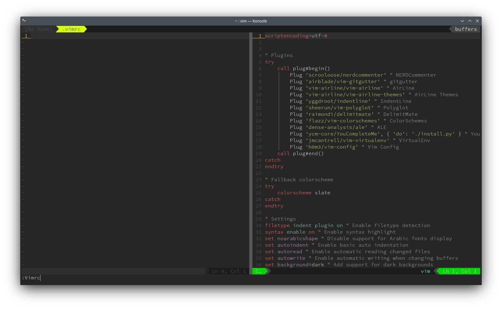

# vim-config

A simple plugin that allows a easy way to open your Vimrc



# Installation

You can use vim 8 or nvim built-in package manager, check out :help packages.

### For Vim 8+

```sh
mkdir -p ~/.vim/pack/git-plugins/start
git clone https://github.com/h0m3/vim-config ~/.vim/pack/git-plugins/start/vim-config
```

### For NeoVim

```sh
mkdir -p ~/.local/share/nvim/site/pack/git-plugins/start
git clone https://github.com/h0m3/vim-config ~/vimfiles/pack/git-plugins/start/vim-config
```

Or you can use your favorite plugin manager such as [vim-plug](https://github.com/junegunn/vim-plug) or [vundle](https://github.com/VundleVim/Vundle.vim).

# Getting Started

You can load your vimrc by just typing `:Vimrc` for vim settings and `:Gvimrc` for gVim settings (if supported).

If you need help try `:help vim-config`

## Shortcuts

By default vim-config doesn't come with any shortcut setup, but it should be easy to setup as any other shortcut on vim

```vim
nnoremap <C-y> :Vimrc<cr>
inoremap <C-y> <C-o>:Vimrc<cr>
vnoremap <C-y> <esc>:Vimrc<cr>
```

## Autoreload vimrc

By default vim-config comes with a autocommand that allows vimrc to be reloaded on save. If you dont want that feature
you can disable it by setting

```vim
    let g:vim_config_autoreload=0
```

# License

VimConfig is hapily shared under BSD Three Clause License.
See https://opensource.org/licenses/BSD-3-Clause.
